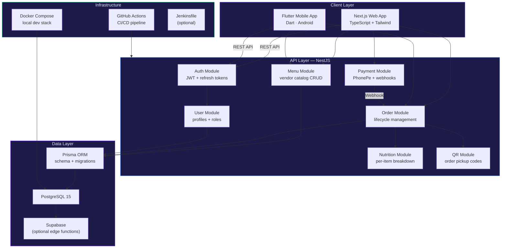

<div align="center">

# VEats — Campus Food Platform

**Queue-free campus takeaway with multi-vendor single-checkout, nutrition tracking, QR code pickup, and PhonePe payment integration — web + mobile**


</div>

---

## The Problem

Campus food courts generate long queues during peak hours, with students waiting 15–30 minutes just to order. Multiple vendors operate independently — no unified cart, no cross-vendor checkout, no advance ordering. Students waste class gaps standing in line. Vendors lack digital order management. And there's no visibility into nutritional data for health-conscious students or hostel mess alternatives.

VEats eliminates queuing entirely. Students browse menus from all campus vendors in one app, build a unified cart, pay digitally, and receive a QR code for contactless pickup — all before leaving the classroom.

---

## What This Does

A production-grade campus food ordering platform spanning web, mobile, vendor dashboard, and admin panel.

- **Multi-vendor single cart** — order from multiple campus eateries in one checkout
- **QR code pickup** — unique per-order QR generated on payment, scanned by vendor for contactless handoff
- **Nutrition tracking** — calorie, protein, carb, and fat breakdown per item and per cart total
- **PhonePe integration** — UPI payment gateway with webhook verification (production-ready stubs)
- **Vendor panel** — order queue management, menu CRUD, prep-time estimates, item availability toggle
- **Admin dashboard** — platform-wide analytics, vendor onboarding, user management
- **Mobile app** — Flutter-based Android companion app mirroring web functionality
- **CI/CD pipeline** — GitHub Actions for automated testing and deployment

---

## System Architecture



---

## Tech Stack

| Layer | Technology | Role |
|:---|:---|:---|
| **Web Frontend** | Next.js 14, TypeScript, Tailwind CSS | Student-facing ordering UI, vendor panel, admin dashboard |
| **Mobile** | Flutter (Dart) | Android companion app |
| **API Backend** | NestJS 10, TypeScript | Modular REST API with guards, interceptors, DTOs |
| **ORM** | Prisma | Type-safe database access, migration management |
| **Database** | PostgreSQL 15 | Relational data store for orders, menus, users |
| **Auth** | JWT (access + refresh tokens) | Stateless authentication with role-based guards |
| **Payments** | PhonePe UPI SDK | Digital payment integration with webhook verification |
| **QR Generation** | qrcode library | Unique pickup codes per order |
| **Edge Functions** | Supabase (optional) | Serverless SQL triggers and edge logic |
| **DevOps** | Docker Compose, GitHub Actions | Local dev stack, automated CI/CD |

---

## Core Features

| Feature | Description |
|:---|:---|
| **Multi-Vendor Cart** | Add items from different campus vendors into a single cart — one checkout, one payment |
| **QR Pickup** | Unique QR code generated per order after payment → vendor scans to confirm pickup |
| **Nutrition Tracker** | Calorie, protein, carb, fat breakdown per item → aggregated in cart view |
| **Vendor Dashboard** | Real-time order queue, prep-time estimation, menu editor, item availability toggle |
| **Admin Panel** | Platform analytics, vendor onboarding, user management, revenue reports |
| **PhonePe Payments** | UPI-based payment flow with server-side webhook signature verification |
| **Order Lifecycle** | `placed → accepted → preparing → ready → picked_up` with real-time status updates |
| **Role-Based Access** | `student`, `vendor`, `admin` roles with JWT guard enforcement |

---

## Getting Started

### Prerequisites
- Node.js 20+, npm 9+
- Docker Desktop (for PostgreSQL)
- Flutter SDK (for mobile only)

### Quick Start

```bash
# Clone the repository
git clone https://github.com/Hazz-Y/VEats-Campus-Food-Platform.git
cd VEats-Campus-Food-Platform

# Start PostgreSQL
cd infra && docker-compose up -d postgres

# Backend
cd ../backend
cp .env.example .env    # Configure DATABASE_URL, JWT_SECRET
npm install
npx prisma migrate dev --name init
npx prisma generate
npm run start:dev       # → http://localhost:3001

# Seed demo data
cd .. && bash scripts/seed_dev_db.sh
# Seeds: 3 vendors, 9 menu items, demo users

# Frontend
cd frontend
cp .env.example .env.local
npm install
npm run dev             # → http://localhost:3000

# Mobile (optional)
cd ../mobile
flutter pub get && flutter run
```

### Environment Variables

| Variable | Required | Description |
|:---|:---|:---|
| `DATABASE_URL` | Yes | PostgreSQL connection string |
| `JWT_SECRET` | Yes | 32+ character JWT signing secret |
| `NEXT_PUBLIC_API_URL` | Yes | Backend URL for frontend |
| `PHONEPE_MID` | Prod | PhonePe Merchant ID |
| `PHONEPE_SECRET` | Prod | PhonePe API Secret |
| `SUPABASE_URL` | Optional | Supabase project URL |

---

## Project Structure

```
VEats-Campus-Food-Platform/
├── frontend/                    # Next.js + TypeScript + Tailwind
│   ├── components/              # Menu cards, cart, QR display, nutrition
│   ├── pages/                   # Student, vendor, admin views
│   └── styles/
├── backend/                     # NestJS + Prisma + PostgreSQL
│   ├── src/
│   │   ├── auth/                # JWT strategy, guards, decorators
│   │   ├── orders/              # Order lifecycle, QR generation
│   │   ├── menus/               # Vendor menu CRUD
│   │   ├── payments/            # PhonePe webhook handler
│   │   ├── users/               # Profile, role management
│   │   └── nutrition/           # Per-item macro calculations
│   └── prisma/                  # Schema, migrations, seed
├── mobile/                      # Flutter (Dart) Android app
├── infra/                       # Docker Compose configs
├── scripts/                     # Seed data, dev utilities
├── .github/                     # GitHub Actions CI/CD
└── README.md
```

---

## Testing

```bash
# Backend unit + integration tests
cd backend && npm test

# Frontend tests
cd frontend && npm test

# E2E (Cypress — if configured)
npm run test:e2e
```

---

## License

MIT — see [LICENSE](LICENSE) for details.
